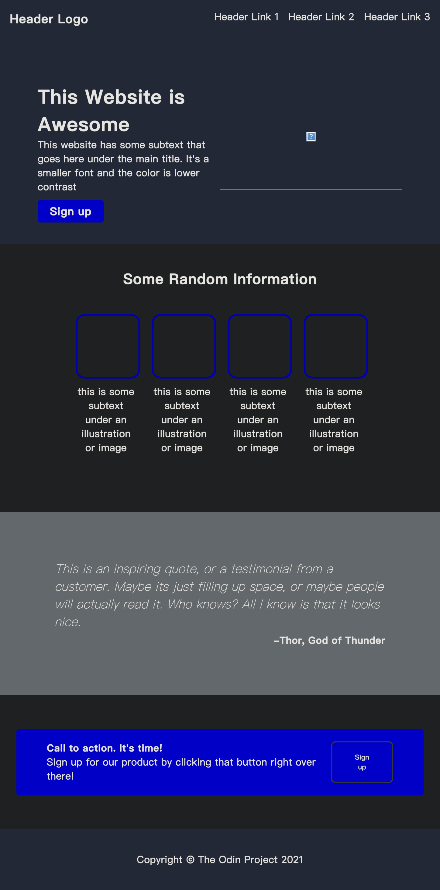

# TOP Landing Page

A professional, multi-page landing site template built with **HTML, CSS, and vanilla JavaScript**.
It includes reusable page structure, responsive layouts for desktop/mobile, dark mode, and lightweight interactive behaviors.

## Live Demo
- **GitHub Pages:** https://mrglasswillbreak.github.io/TOPLandingPage/

## Project Highlights
- Multi-page structure: Home, About, Features, Contact
- Responsive navigation with mobile menu toggle
- Light/Dark theme toggle with persisted preference (`localStorage`)
- Reusable UI sections (hero, cards, quote, CTA, forms)
- Client-side form feedback for newsletter/contact forms
- Back-to-top button and dynamic footer year

## Screenshots

### Home Page (Desktop)


### Feature/Section Preview


### Mobile-Style Preview


## Tech Stack
- **HTML5**
- **CSS3**
- **JavaScript (ES6+)**

## Project Structure

```text
TOPLandingPage/
├── index.html
├── about.html
├── features.html
├── contact.html
├── style.css
├── script.js
├── 01.png
├── 02.png
├── untitled.jpeg.png
└── README.md
```

## Getting Started

### 1) Clone the repository
```bash
git clone https://github.com/mrglasswillbreak/TOPLandingPage.git
cd TOPLandingPage
```

### 2) Run locally
Use any static server. Example:

```bash
python3 -m http.server 8080
```

Open:
- `http://127.0.0.1:8080/index.html`

## Core Pages
- `index.html` — marketing-style landing page with CTA and newsletter form
- `about.html` — organization overview and mission content
- `features.html` — product features and boilerplate pricing cards
- `contact.html` — contact form and support entry point

## Accessibility & UX Notes
- Navigation controls include ARIA labels/states
- Form areas use semantic labels and validation handling
- Layout adapts to narrow viewports with responsive breakpoints

## Roadmap Ideas
- Add real backend integration for form submissions
- Add favicon, SEO metadata, and Open Graph tags
- Add automated linting/format checks
- Add componentized architecture (e.g., with a build tool)

## Author
**Moe**  
Aspiring Full-Stack Developer

---
If this project helped you, consider giving it a ⭐ on GitHub.
